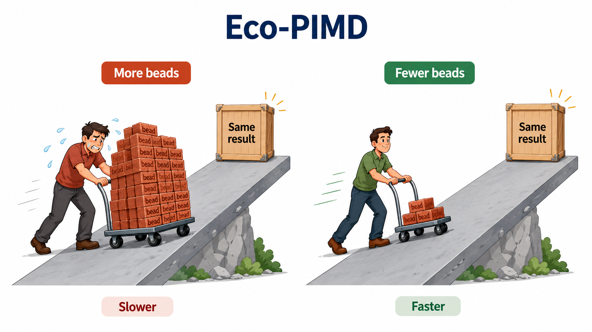

# Eco Path Integrals in GPUMD

This repository provides a source-code patch for adding **Eco Path Integrals** to the GPUMD (https://gpumd.org/) implementation of path-integral molecular dynamics (PIMD).

Eco PIMD accelerates PIMD convergence by replacing the primitive Trotter ring-polymer internal-mode frequencies with optimized frequencies. We refer readers to our [arXiv paper](https://arxiv.org/abs/2607.06414) for the detailed theoretical background.

<p align="center">
  
</p>

## 1. Requirements

### Python

The patcher only needs standard Python:

```bash
python3
```

### GPUMD compilation

The patched GPUMD requires:

```text
CUDA
C++14-compatible compiler
LAPACK/BLAS
```
LAPACK/BLAS is needed because the Eco optimizer diagonalizes a Hessian using `dsyev_`.

On many HPC systems, OpenBLAS is sufficient. For example:

```bash
module load CUDA
module load OpenBLAS
```

## 2. How to apply the patch

Start from a clean GPUMD 4.6 source tree:

```bash
cp -r GPUMD-4.6 GPUMD-4.6-ecopimd
cd GPUMD-4.6-ecopimd
```

Copy the patcher into this folder:

```bash
cp /path/to/patch_gpumd46_pimd_modes_strict_fortran.py .
```

Apply the patch:

```bash
python3 patch_gpumd46_pimd_modes_strict_fortran.py . --max-beads 512
```

The `--max-beads` option is optional. It changes the compile-time maximum bead number allowed by GPUMD.

The patch modifies the GPUMD PIMD source files under:

```text
src/integrate/
```

Backups of the original files are automatically generated.

After patching, compile GPUMD as usual:

```bash
cd src
make clean
make -j
```
If LAPACK/OpenBLAS is linked correctly, the executable `gpumd` should be generated.

## 3. How to run Eco-PIMD

The original GPUMD PIMD syntax still works:

```text
ensemble pimd P T1 T2 tau_T
```
This uses the original Trotter internal-mode frequencies.

To explicitly choose the internal-mode scheme:

```text
ensemble pimd P T1 T2 tau_T trotter
ensemble pimd P T1 T2 tau_T matsubara
ensemble pimd P T1 T2 tau_T eco omega_max_cm1
```

For example:

```text
ensemble pimd 160 100 100 100 eco 3500
```

For NPT-PIMD, append the option after the pressure-control parameters. For example:

```text
ensemble pimd 160 60 60 100 0.0 100.0 1000 eco 3500
```

Here `3500` means

$$
\omega_{\max} = 3500~\mathrm{cm}^{-1}.
$$

This is a wavenumber cutoff, not an angular frequency.

The dimensionless fitting range is

$$
x_{\max} =
\beta\hbar\omega_{\max} =
1.438776877
\frac{\omega_{\max}^{\mathrm{cm}^{-1}}}{T}.
$$

For physical simulations over a temperature range, keep the same physical cutoff, for example `eco 3500`, at all temperatures.

## 4. RMSE output

When using the `eco` option, GPUMD prints the fitting errors:

```text
RMSE(trotter)=...
RMSE(matsubara)=...
RMSE(eco)=...
```

These RMSE values depend only on $P$ and $x_{\max} = \beta\hbar\omega_{\max}$. They do not depend on the material, potential, cell size, or atom number.

For a fixed $x_{\max}$, Eco should give a much smaller RMSE than primitive Trotter PIMD at the same bead number.

When plotting RMSE versus bead number, make sure all data points use the same $x_{\max}$. Mixing different temperatures or different $\omega_{\max}$ values can create artificial non-monotonic behavior.

## 5. Citation

If you use this patch, please cite the paper:

```text
Zezhu Zeng and David E. Manolopoulos, [Economised path integrals](https://arxiv.org/abs/2607.06414). 
```
